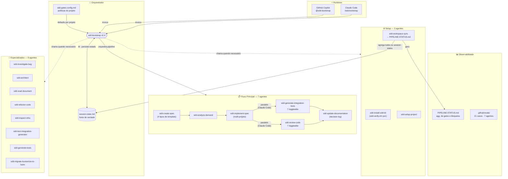
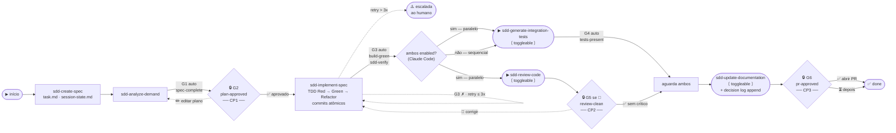

# Context Engineering & SDD Kit — v2.4

**Spec-Driven Development com orquestração autônoma, quality gates configuráveis, paralelismo de agentes e suporte a GitHub Copilot e Claude Code.**

> Maturidade atual: **N4** — agent com loop, quality gates com integridade verificável, 3 checkpoints humanos, evals, versionamento e observabilidade centralizados.
> Consulte o [ROADMAP](ROADMAP.md) para histórico de versões e próximos passos.

---

## O que é este kit?

O SDD Kit combina duas práticas:

**Context Engineering** — estruturar, manter e disponibilizar contexto de alta qualidade para o agente de IA: arquitetura, regras de negócio, padrões, histórico de decisões. O agente nunca precisa adivinhar o que o projeto faz.

**Spec-Driven Development (SDD)** — escrever a análise antes de escrever o código. Para cada demanda, o agente produz um `task.md` com a análise completa, plano de implementação e decisões — rastreável, revisável e reutilizável.

O contexto é organizado em camadas:

| Camada | Arquivo/Pasta | Propósito |
|--------|--------------|-----------|
| Instruções globais | `copilot-instructions.md` | Regras gerais: Java, Spring, arquitetura, testes, docs |
| Instruções do agente | `AGENTS.md` | Comportamento obrigatório e fluxo de implementação |
| Instruções técnicas | `.github/instructions/` | Regras por tecnologia, ativadas por `applyTo` |
| Contexto do projeto | `.github/docs/project-context/` | Visão geral, arquitetura atual, mapa de módulos, decision log |
| Specs de demandas | `.github/docs/specs/` | Análises e planos por ticket (`session-state.md` + `task.md`) |

---

## Visão Geral — Ecossistema e Pipeline

### Ecossistema de Agentes



---

### Pipeline de Execução Autônoma



> **Leitura do diagrama:** setas sólidas `→` são o fluxo autônomo; setas tracejadas `-.->` são fluxos de correção/recuperação. Os losangos `{}` com 🔒 são os 3 checkpoints humanos. Os nós `▶` são etapas toggleable — quando desabilitadas, o bootstrap recalcula a rota. No Claude Code, tests e review rodam em paralelo após implement; no Copilot, rodam em sequência.

---

## Estrutura por Projeto

```
<projeto>/
├── sdd-verify.sh          # Script padronizado de build (G3) — criado pelo sdd-install-sdd-kit
├── sdd-verify.ps1         # Versão PowerShell do mesmo script
│
├── .claude/
│   └── agents/            # Agentes para Claude Code (frontmatter name:)
│       ├── sdd-analyze-demand.md
│       ├── sdd-implement-spec.md
│       └── sdd-update-documentation.md  # + outros conforme necessário
│
├── .github/
│   ├── AGENTS.md                        # Comportamento obrigatório do agente
│   ├── copilot-instructions.md          # Contexto principal do projeto
│   ├── sdd-gates.config.md              # Políticas de gate padrão do projeto
│   ├── PIPELINE-STATUS.md               # Dashboard de gates (gerado por sdd-workspace-sync)
│   │
│   ├── agents/                          # Agentes para GitHub Copilot (.agent.md)
│   │   ├── sdd-analyze-demand.agent.md
│   │   ├── sdd-implement-spec.agent.md
│   │   ├── sdd-generate-integration-tests.agent.md
│   │   ├── sdd-review-code.agent.md
│   │   ├── sdd-update-documentation.agent.md
│   │   ├── sdd-bootstrap.agent.md
│   │   └── _template/
│   │       └── session-state.md         # Template de estado do pipeline
│   │
│   ├── evals/                           # Casos de teste dos agentes principais
│   │   ├── sdd-bootstrap/case-01/ … case-03/
│   │   ├── sdd-implement-spec/case-01/ … case-03/
│   │   └── …                           # 7 agentes × 3 casos × 3 arquivos = 63 arquivos
│   │
│   ├── instructions/                    # Regras técnicas por arquivo/tecnologia
│   │   ├── architecture.instructions.md
│   │   ├── database.instructions.md
│   │   └── messaging.instructions.md
│   │
│   └── docs/
│       ├── project-context/             # Contexto permanente do projeto
│       │   ├── project-overview.md
│       │   ├── current-architecture.md
│       │   ├── module-map.md
│       │   ├── decisions-log.md         # ← NOVO: log append-only de decisões entre demandas
│       │   └── …
│       ├── architecture/                # ADRs e diagramas
│       ├── testing/
│       └── specs/
│           ├── _template/
│           │   ├── session-state.md     # Template de estado
│           │   └── types/               # ← NOVO: templates por tipo de demanda
│           │       ├── task-feature.md
│           │       ├── task-bugfix.md
│           │       ├── task-refactor.md
│           │       └── task-migration.md
│           └── JT-XXXX/                # Uma pasta por demanda
│               ├── task.md             # Análise e plano de implementação
│               └── session-state.md    # Estado do pipeline (fonte de verdade)
│
~/.claude/agents/
└── sdd-bootstrap.md                    # Orquestrador global (Claude Code)
```

> **Dois runtimes, dois lugares:** agentes em `.github/agents/` são lidos pelo GitHub Copilot; agentes em `.claude/agents/` são lidos pelo Claude Code. O conteúdo é o mesmo — apenas o frontmatter difere (`mode: agent` vs `name:`).

---

## sdd-bootstrap — Orquestrador Universal

O `sdd-bootstrap` é o ponto de entrada único. Lê o `session-state.md` da demanda, decide o próximo agente, executa, avalia o quality gate conforme sua política e ao final de cada ação apresenta um painel de status.

### Invocação

```bash
# GitHub Copilot
@sdd-bootstrap <PROJECT> <TICKET> [--step|--run] [opções]

# Claude Code
/sdd-bootstrap <PROJECT> <TICKET> [--step|--run] [opções]
```

### Modos de operação

| Modo | Flag | Comportamento |
|------|------|---------------|
| **Passo-a-passo** | `--step` *(padrão)* | Executa um agente, mostra o painel e devolve o controle. Ideal para retomada manual e troca de runtime. |
| **Autônomo** | `--run` | Pipeline contínuo — para só em gates `confirm` e nos 3 checkpoints humanos. |

### Pipeline de 5 Etapas + 6 Quality Gates

```
analyze ──[G1]──► implement ──[G2]──[G3 sdd-verify]──► tests ┐──[G4]──► docs ──[G6]──► done
                              🔒 humano                       │                  🔒 humano
                                                         paralelo (CC)
                                                              │
                                                    review ──[G5]──►─┘
                                                              🔒 se 🔴
```

| Etapa | Agente | Gate | Toggleable | Paralelo (CC) |
|-------|--------|------|:---:|:---:|
| analyze | `sdd-analyze-demand` | G1 spec-complete | não | — |
| implement | `sdd-implement-spec` | G2 plan-approved · G3 build-green | não | — |
| tests | `sdd-generate-integration-tests` | G4 tests-present | ✅ | ✅ |
| review | `sdd-review-code` | G5 review-clean | ✅ | ✅ |
| docs | `sdd-update-documentation` | G6 pr-approved | ✅ | — |

> **Paralelismo (Claude Code):** após G3 passed, se `tests` e `review` estiverem ambos habilitados, o bootstrap dispara os dois como subagents paralelos via Agent tool. Os resultados são coletados antes de `docs`. No Copilot, a execução é sequencial.

### 3 Checkpoints Humanos

O pipeline só para **em 3 pontos definidos**. Entre eles, avança autonomamente.

| Checkpoint | Gate | Quando | Opções |
|-----------|------|--------|--------|
| **CP1 — Plano** | G2 | Antes de qualquer código | `[S]` aprovar · `[E]` editar · `[N]` abortar |
| **CP2 — Crítico** | G5 | Se review encontrar 🔴 | `[C]` corrigir · `[I]` ignorar c/ justificativa · `[N]` abortar |
| **CP3 — PR** | G6 | Fim do pipeline | `[S]` abrir PR · `[N]` depois |

### G3 — Build-Green com `sdd-verify`

O G3 nunca é pulado — nem com `--disable=tests` (que só desabilita o G4). Para marcar G3 `passed`, o bootstrap usa o script padronizado quando disponível:

```bash
bash sdd-verify.sh        # Linux/Mac — saída: SDD-VERIFY | RESULT=PASSED/FAILED
pwsh sdd-verify.ps1       # Windows
```

O script verifica automaticamente a versão do JDK (`JAVA_HOME`) contra o `pom.xml` e roda `./mvnw clean test`. Falhas de compilação, spotless e testes todos reprovam G3.

> Se `sdd-verify` não existir, o bootstrap usa `./mvnw clean test` diretamente. O script é criado pelo `sdd-install-sdd-kit` em projetos Java.

### Recuperação de Falha

Se um gate automático falha, o bootstrap reexecuta o agente com o erro injetado no contexto — até 3 tentativas. Persistindo, escala para o humano com `blocked_on` preenchido. **Nunca mascara um gate falho.**

### Integridade de Gates (`anti-reconcile`)

Gates `auto` (G1/G3/G4) **nunca** são marcados `passed` por herança de outro runtime. Quando `last_runtime` ≠ runtime atual (ex: estado vindo do Copilot), todos os gates `auto` são rebaixados para `pending` e reexecutados. O termo `reconcile` só se aplica a gates `confirm`/🔒 com decisão humana já registrada.

---

## Políticas de Gate

Cada gate tem uma **política** que decide se para ou avança:

| Política | Comportamento |
|----------|---------------|
| `auto` | Avalia o critério. Passou → avança. Falhou → recuperação automática. |
| `confirm` | Avalia, mas **sempre pausa** para confirmação humana. |
| `skip` | Não avalia. Marca `skipped` e avança. |

### Precedência (a mais específica vence)

```
1. Flag na invocação       (--auto=G3, --pause-at=G4)
2. Policy no session-state (salva entre sessões)
3. .github/sdd-gates.config.md (default do projeto)
4. Default do bootstrap    (profile=safe)
```

### Perfis

| Perfil | G1 | G2 plano | G3 build | G4 tests | G5 review | G6 PR |
|--------|:--:|:--------:|:--------:|:--------:|:---------:|:-----:|
| `safe` *(default)* | auto | confirm | auto | auto | confirm¹ | confirm |
| `fast` | auto | auto | auto | auto | confirm¹ | confirm |
| `paranoid` | confirm | confirm | confirm | confirm | confirm | confirm |
| `yolo` | auto | auto | auto | auto | auto | auto |

¹ G5 só pausa se houver achado 🔴 Crítico.

> **Segurança:** G2, G5 e G6 só aceitam `auto`/`skip` via flag nominal explícita (`--auto=G6`) ou `--profile=yolo`. `skip` em G6 exige `--force-skip=G6`.

### Flags de controle

| Flag | Efeito |
|------|--------|
| `--profile=fast` | Aplica o conjunto de políticas do perfil |
| `--pause-at=G3,G4` | Força esses gates a `confirm` |
| `--auto=G2` | Força o gate a `auto` (não para) |
| `--skip=G4` | Pula o gate (não avalia) |
| `--force-skip=G6` | Necessário para pular o gate de PR |
| `--enable=tests,review` | Habilita etapas toggleable |
| `--disable=review,docs` | Desabilita etapas toggleable |

### Etapas Toggleable

Três etapas podem ser ligadas ou desligadas por demanda ou por projeto. Quando desabilitada, a etapa é pulada e o gate correspondente marcado como `skipped`.

| Alias | Agente | Gate afetado | Nota |
|-------|--------|:---:|------|
| `tests` | `sdd-generate-integration-tests` | G4 | Não afeta G3 (build) |
| `review` | `sdd-review-code` | G5 | — |
| `docs` | `sdd-update-documentation` | G6 | — |

> As etapas core (`analyze`, `implement`) não podem ser desabilitadas.

### Configuração padrão do projeto (`.github/sdd-gates.config.md`)

```markdown
profile: safe
tests:  enabled
review: enabled
docs:   enabled
# G3: confirm   ← descomente para forçar confirmação no build
```

---

## Painel de Status

Ao final de **cada** ação, o bootstrap imprime o estado completo do pipeline:

```
━━━━━━━━━━━━━━━━━━━━━━━━━━━━━━━━━━━━━━━━━━━━━
  ✓ AÇÃO CONCLUÍDA — sdd-implement-spec@2.4.0   [run · safe]
━━━━━━━━━━━━━━━━━━━━━━━━━━━━━━━━━━━━━━━━━━━━━
Resultado:  spec implementada, 3 commits atômicos, build verde (sdd-verify)
Gate G3 (build-green): ✓ passed  [auto]
Runtime:    claude-code · 14:32

Pipeline Steps:
  ✓ analyze   ✓ implement   ▶ tests(running)   ▶ review(running)   ● docs[G6:confirm]

Quality Gates:
  G1[auto]✓  G2[confirm]✓  G3[auto]✓  G4[auto]pending  G5[confirm]pending  G6[confirm]pending

Próximo: aguardando tests + review (paralelo)
━━━━━━━━━━━━━━━━━━━━━━━━━━━━━━━━━━━━━━━━━━━━━
```

Símbolos: `✓` concluído · `▸` atual · `▶` running (paralelo) · `●` enabled pendente · `◯` disabled.

---

## session-state.md — Fonte de Verdade Entre Runtimes

Cada demanda tem um `session-state.md` em `.github/docs/specs/TICKET/`. Ele persiste o estado entre sessões e runtimes (Copilot ↔ Claude Code).

| Campo | O que registra |
|-------|----------------|
| `status` | Estado atual da demanda |
| `run_mode` | `step` ou `run` |
| `profile` | Perfil de políticas aplicado |
| `awaiting_checkpoint` | Checkpoint humano pendente (pausa o pipeline) ou `—` |
| `retries` | Contador de tentativas de recuperação |
| `blocked_on` | Impedimento atual ou `—` |
| `affected_projects` | Projetos adicionais afetados por esta demanda (multi-projeto) |
| `Pipeline Steps` | Tabela das 5 etapas com `Estado` (`enabled`/`disabled`/`running`) |
| `Quality Gates` | Tabela dos 6 gates com `Policy` e `Status` |
| `Agent History` | Tabela append-only: timestamp, `agente@versão`, runtime, mode, gate, resultado |

O template está em `.github/agents/_template/session-state.md`.

---

## Evals dos Agentes

O SDD Kit inclui um conjunto de casos de avaliação em `.github/evals/` para os 7 agentes do fluxo principal. Cada caso tem 3 arquivos:

| Arquivo | Conteúdo |
|---------|----------|
| `input.md` | Cenário de entrada: project, ticket, estado do session-state, contexto de código |
| `expected.md` | Comportamentos esperados (checklist) e outputs proibidos |
| `rubric.md` | Critérios de avaliação com pesos (0–100), critérios bloqueantes e threshold mínimo |

**21 casos totais (3 por agente):**

| Agente | Case-01 | Case-02 | Case-03 | Score mínimo |
|--------|---------|---------|---------|:---:|
| sdd-bootstrap | Anti-reconcile (G3 herdado) | Escalada por retries | Spec inexistente | 85% |
| sdd-analyze-demand | Demanda bem especificada | Demanda vaga | Contexto de migração | 80% |
| sdd-implement-spec | CP1 pendente (não implementar) | G2 aprovado → implementar | Path errado no plano | 80% |
| sdd-generate-integration-tests | Endpoint REST novo | tests disabled | Kafka consumer | 75% |
| sdd-review-code | SQL injection (🔴 crítico) | Apenas achados 🟡 | review disabled | 80% |
| sdd-update-documentation | Demanda concluída | docs disabled | Múltiplos documentos | 80% |
| sdd-create-spec | Ticket + tipo informado | Tipo não informado | Com descrição | 90% |

Rodar os evals manualmente antes de publicar mudanças em agentes críticos. Use `sdd-review-code` como juiz-LLM para avaliar outputs contra a rubrica.

---

## Decision Log por Projeto

O arquivo `decisions-log.md` em `.github/docs/project-context/` registra decisões técnicas acumuladas entre demandas:

- **sdd-update-documentation** faz append automático após cada demanda concluída (campo `Decisions Made` do `task.md`)
- **sdd-implement-spec** lê o log antes de analisar código para detectar decisões conflitantes
- Cada entrada: Ticket, Data, Contexto, Decisão, Consequências

Isso evita que uma demanda implemente algo que contradiz uma decisão tomada 3 sprints atrás.

---

## Templates de Spec por Tipo

O `sdd-create-spec` pergunta o tipo de demanda e usa o template correspondente:

| Tipo | Template | Seções específicas |
|------|----------|--------------------|
| `feature` | `task-feature.md` | Non-Functional Requirements |
| `bugfix` | `task-bugfix.md` | Steps to Reproduce, Root Cause Analysis, Regression Prevention |
| `refactor` | `task-refactor.md` | Current Problems, Compatibility Constraints, Rollback Strategy |
| `migration` | `task-migration.md` | Wave/Onda, Data Migration, Phase Gates, ADRs Referenced |

Templates em `.github/docs/specs/_template/types/`.

---

## 8 Cenários — Comandos Prontos

| # | Cenário | Comando |
|---|---------|---------|
| ① | Feature em projeto existente | `/sdd-bootstrap proj JT-100 --run` |
| ② | Migração de legado (paranoid) | `/sdd-bootstrap proj JT-200 --run --profile=paranoid` |
| ③ | Projeto do zero | `/sdd-install-sdd-kit proj` → `/sdd-bootstrap proj JT-300 --run` |
| ④ | Hotfix rápido | `/sdd-bootstrap proj BUG-400 --run --disable=tests,review` |
| ⑤ | Testes standalone | `/sdd-read-document specs.pdf` → `/sdd-bootstrap auto JT-500 --run --disable=tests` |
| ⑥ | Demanda multi-projeto | `/sdd-create-spec proj JT-600 --type=feature` → editar `affected_projects` no session-state → `/sdd-bootstrap proj JT-600 --run` |
| ⑦ | Bugfix com template específico | `/sdd-create-spec proj BUG-700 --type=bugfix` → `/sdd-bootstrap proj BUG-700 --run --disable=docs` |
| ⑧ | Inspeção build antes de avançar | `/sdd-bootstrap proj JT-800 --run --pause-at=G3` |

---

## Agentes Disponíveis (18)

Todos com `version: "2.4.0"` no frontmatter. O bootstrap registra `agente@versão` no Agent History e avisa em caso de mudança.

### Fluxo Principal (7)

| Agente | Responsabilidade | Gates |
|--------|-----------------|:-----:|
| `sdd-bootstrap` | **Orquestrador universal** — lê estado, executa loop, paralela tests+review (CC), avalia gates, apresenta painel | todos |
| `sdd-create-spec` | Cria pasta `JT-XXXX/` com template por tipo (feature/bugfix/refactor/migration) e `session-state.md` | — |
| `sdd-analyze-demand` | Lê docs da demanda, preenche `task.md`, classifica requisitos com MoSCoW | G1 |
| `sdd-implement-spec` | Analisa código, lê decision log, TDD Red→Green→Refactor, suporte multi-projeto, commits atômicos | G2, G3 |
| `sdd-generate-integration-tests` | Testes E2E (BDD + Testcontainers + WireMock), exportação Zephyr Scale | G4 |
| `sdd-review-code` | Review multi-perspectiva: Spec, Arquitetura, Corretude, Qualidade, OWASP, Testes — classifica 🔴🟡🔵✅ | G5 |
| `sdd-update-documentation` | Atualiza `project-context/`, `architecture/`, fecha spec, faz append no `decisions-log.md` | G6 |

### Setup (3)

| Agente | Responsabilidade |
|--------|-----------------|
| `sdd-install-sdd-kit` | Instala o kit completo: `.github/`, `.claude/`, `sdd-gates.config.md`, `decisions-log.md`, `sdd-verify.sh`/`.ps1` |
| `sdd-setup-project` | Discovery técnico completo: preenche todos os docs de contexto + índice DeepWiki com diagramas Mermaid |
| `sdd-workspace-sync` | Catálogo de repositórios + painel de demandas + `PIPELINE-STATUS.md` (pass rate por gate, bloqueios) + métricas de sprint |

### Especializados (8)

| Agente | Responsabilidade |
|--------|-----------------|
| `sdd-architect` | ADRs, diagramas C4, Well-Architected Framework (5 pilares), OWASP |
| `sdd-investigate-bug` | Investigação estruturada de bug com rastreamento de causa raiz — sem alterar código |
| `sdd-refactor-code` | Refatoração com rastreabilidade e preservação de contratos públicos e testes |
| `sdd-read-document` | Lê Word (`.docx`) e PDF — extrai conteúdo estruturado para uso nos demais agentes |
| `sdd-inspect-infra` | Mapeamento de credenciais Helm/Kustomize, inspeção kubectl, ambientes sandbox GDA |
| `sdd-migrate-kustomize-to-helm` | Migração de Kustomize para Helm usando o chart interno `convair-helm` |
| `sdd-generate-tests` | Geração de testes unitários para código existente sem cobertura |
| `sdd-test-integration-generator` | Projeto standalone de testes: Java (Cucumber + Testcontainers + WireMock) ou Node (Cypress) |

---

## PIPELINE-STATUS.md — Observabilidade Centralizada

O `sdd-workspace-sync` gera automaticamente `.github/PIPELINE-STATUS.md` com:

| Seção | Conteúdo |
|-------|----------|
| Resumo Executivo | Demandas ativas, concluídas, bloqueadas, em checkpoint, retries acumulados |
| Taxa por Gate | G1–G6: avaliados, passed, failed, pass rate (%) |
| Demandas Bloqueadas | Projeto, ticket, causa do bloqueio, data |
| Em Checkpoint | Ticket aguardando humano há quanto tempo |
| Histórico por Demanda | Tabela com status de G1–G6 por demanda |

---

## Como Instalar

### GitHub Copilot

1. Abra o VS Code no projeto com Copilot em modo **Agent** (`@agent`)
2. Execute:
```
@sdd-install-sdd-kit
```
> Cria toda a estrutura `.github/`: `AGENTS.md`, `copilot-instructions.md`, `instructions/`, `agents/`, `docs/`, `sdd-gates.config.md`, `decisions-log.md` e `sdd-verify.sh`/`.ps1` (projetos Java).

3. Preencha o contexto do projeto:
```
@sdd-setup-project
```

### Claude Code

1. Certifique-se que `~/.claude/agents/sdd-bootstrap.md` existe (agente global do kit)
2. Execute o install para criar `.claude/agents/` e todos os arquivos necessários:
```
/sdd-install-sdd-kit
```
> O agente cria `.claude/agents/` automaticamente com frontmatter Claude Code (`name:`) e também cria `sdd-verify.sh`/`.ps1` e `decisions-log.md`.

3. Confirme com `/sdd-setup-project` para preencher os docs de contexto.

---

## Como Usar no Dia a Dia

### Iniciando uma demanda

```bash
# 1. Crie a pasta da demanda com template por tipo
/sdd-create-spec <PROJECT> JT-1234 --type=feature

# 2. Coloque specs, acceptance-criteria ou PDFs em .github/docs/specs/JT-1234/

# 3. Rode o pipeline completo
/sdd-bootstrap <PROJECT> JT-1234 --run
```

O bootstrap para nos 3 checkpoints humanos e avança autonomamente entre eles.

### Exemplos de variações

```bash
# Migração com confirmação em todos os gates
/sdd-bootstrap proj JT-200 --run --profile=paranoid

# Hotfix rápido — sem testes de integração e sem review
/sdd-bootstrap proj BUG-400 --run --disable=tests,review

# Inspeção manual do build antes de avançar
/sdd-bootstrap proj JT-300 --run --pause-at=G3

# Docs automáticos (sem parada no G6)
/sdd-bootstrap proj JT-500 --run --auto=G6

# Demanda que afeta dois projetos
# 1. Crie a spec e edite affected_projects no session-state.md
/sdd-create-spec proj JT-600 --type=feature
# Edite session-state.md: affected_projects: proj-a, proj-b
/sdd-bootstrap proj JT-600 --run
```

### Retomando de onde parou (troca de runtime)

O `session-state.md` persiste o estado entre sessões. Para retomar:

```bash
# Em qualquer runtime — o bootstrap lê o estado e continua de onde parou
# Gates auto do Copilot são automaticamente revalidados pelo Claude Code
/sdd-bootstrap <PROJECT> <TICKET> --run
```

### Investigando um bug

```bash
# 1. Crie a spec com template de bugfix
/sdd-create-spec <PROJECT> BUG-5678 --type=bugfix

# 2. Investigação estruturada (sem alterar código)
/sdd-investigate-bug <PROJECT> BUG-5678

# 3. Pipeline (sem docs para hotfix)
/sdd-bootstrap <PROJECT> BUG-5678 --run --disable=docs
```

### Análise de migração / legado

```bash
# 1. Leia os documentos de especificação
/sdd-read-document specs-migracao.pdf

# 2. Crie a spec com template de migration
/sdd-create-spec <PROJECT> MIGR-001 --type=migration

# 3. Pipeline com perfil paranoid
/sdd-bootstrap <PROJECT> MIGR-001 --run --profile=paranoid
```

### Verificando o estado de todos os pipelines

```bash
# Gera PIPELINE-STATUS.md com todos os projetos + pass rate por gate
/sdd-workspace-sync
```

---

## Instructions Globais (workspace)

Aplicadas automaticamente pelo Copilot conforme o arquivo editado:

| Instruction | Ativa para |
|-------------|-----------|
| `architecture.instructions.md` | `src/**/*.java` |
| `database.instructions.md` | `**/repository/**`, `**/entity/**`, `**/resources/db/**` |
| `messaging.instructions.md` | `**/*Consumer.java`, `**/*Producer.java`, `**/*Publisher.java` |

---

## Dicas de Uso

- **Sempre use o modo Agent** (`@agent` no Copilot, `/` no Claude Code). O modo Ask não permite leitura de arquivos nem execução de agentes.
- **Revise o `task.md` antes de implementar** — é mais fácil corrigir a análise do que o código. O bootstrap para no G2 para isso.
- **Use `sdd-gates.config.md`** para setar defaults permanentes do projeto (ex: `tests: disabled` num projeto sem E2E).
- **Use templates por tipo** — `--type=bugfix` pré-configura seções de Root Cause e Regression Prevention; `--type=migration` inclui Phase Gates e Rollback Plan.
- **O `decisions-log.md`** cresce a cada demanda concluída. O `sdd-implement-spec` o lê automaticamente para evitar decisões conflitantes entre sprints.
- **Para testes standalone**, use `sdd-test-integration-generator` — gera `test-integration/` versionável fora do build principal.
- **O painel de status** aparece após cada agente — mostra exatamente onde o pipeline está, versão do agente executado e o que vem a seguir.

---

## Projetos com Kit Instalado

Consulte [sdd-kit-status.md](sdd-kit-status.md) para o estado atual de cada projeto. Para uma visão consolidada dos pipelines em execução, consulte `PIPELINE-STATUS.md` ou execute `/sdd-workspace-sync`.

---

## Regra de Ouro

> **Nenhum código é escrito antes de existir um `task.md` aprovado.**

O `task.md` não é burocracia — é a diferença entre implementar o que foi pedido e implementar o que foi entendido. O checkpoint G2 existe exatamente para isso. O `decisions-log.md` garante que decisões passadas não sejam contraditas silenciosamente.
