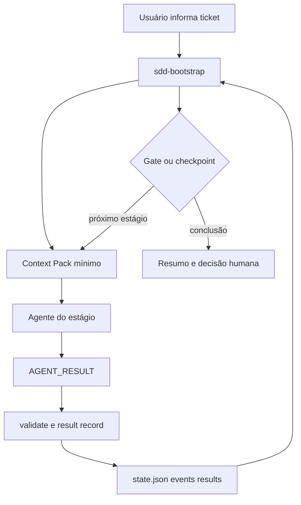

# SDD Toolkit

Toolkit comunitário para Spec-Driven Development: agentes, templates, skills e
instaladores que ajudam a conduzir demandas com contexto, decisões técnicas e
verificações explícitas.

Suporta GitHub Copilot, Claude Code, Codex e Cursor. A licença é [MIT](LICENSE).
O mantenedor inicial é [Felipe Maurício da Silva](docs/MAINTAINERS.md).

> O toolkit orienta o trabalho dos agentes; ele não substitui a revisão humana,
> os controles do runtime nem a validação do projeto consumidor.

## Instalação rápida

Pré-requisitos: Python 3.9+, Git e pelo menos um runtime suportado.

Faça primeiro um preview da instalação global:

```powershell
.\install.ps1 -DryRun
```

```bash
bash install.sh --dry-run
```

> **Importante:** `-DryRun`/`--dry-run` somente mostra o plano; ele **não
> instala** o comando `sdd` nem os agentes. Após conferir o preview, execute
> obrigatoriamente o instalador novamente **sem** essa opção:

```powershell
.\install.ps1 -Runtime all
```

```bash
bash install.sh --runtime=all
```

Em seguida, abra um novo terminal e valide:

```bash
sdd --version
sdd doctor --scope user --json
```

O guia completo está em [docs/QUICKSTART.md](docs/QUICKSTART.md) e
[docs/USER-SCOPE.md](docs/USER-SCOPE.md).

## Primeiro uso

Ative um projeto sem gravar estado pessoal no repositório:

```bash
cd /caminho/do-projeto
sdd activate
sdd start ABC-123
```

Depois, inicie a demanda no runtime escolhido com o bootstrap. O contexto,
specs e estado de sessão ficam no workspace do usuário, não no projeto. Veja o
uso diário e os quatro runtimes em [docs/QUICKSTART.md](docs/QUICKSTART.md).



Cada etapa possui evidência e gates. A etapa arquitetural é proporcional ao
impacto (`low`, `medium` ou `high`); mudanças estruturais usam
`technical-design.md` antes da entrega.

## O que o pacote contém

| Área | Finalidade |
|---|---|
| `agents/` | Fonte dos agentes especializados. |
| `templates/` | Templates de spec, sessão, verificadores e skills. |
| `dist/` | Artefatos compilados para cada runtime. |
| `scripts/` | CLI, compilador, lifecycle, validação e release. |
| `schemas/` | Contratos versionados para estado, instalação e entrega. |
| `evals/` | Casos e rubricas para avaliar o comportamento dos agentes. |

## Documentação

| Assunto | Documento |
|---|---|
| Começar em cinco minutos | [QUICKSTART](docs/QUICKSTART.md) |
| Instalação, update, recovery e uninstall | [USER-SCOPE](docs/USER-SCOPE.md) |
| Arquitetura do toolkit | [ARCHITECTURE](docs/ARCHITECTURE.md) |
| Pipeline, gates e E2E | [PIPELINE](docs/PIPELINE.md) |
| Catálogo de agentes | [AGENTS](docs/AGENTS.md) |
| Contrato dos agentes | [AGENT-CONTRACT](docs/AGENT-CONTRACT.md) |
| Skills disponíveis | [SKILLS](docs/SKILLS.md) |
| Referência da CLI | [CLI-REFERENCE](docs/CLI-REFERENCE.md) |
| Evals e contratos | [EVALUATIONS](docs/EVALUATIONS.md) |
| Arquivos e lifecycle | [FILES-AND-LIFECYCLE](docs/FILES-AND-LIFECYCLE.md) |
| Segurança e threat model | [THREAT-MODEL](docs/THREAT-MODEL.md) |
| Release | [RELEASE](docs/RELEASE.md) |

## Segurança, contribuição e suporte

- Vulnerabilidades: [SECURITY.md](SECURITY.md). Não publique secrets, dados de
  clientes ou detalhes exploráveis em issues.
- Contribuições: [CONTRIBUTING.md](CONTRIBUTING.md), incluindo DCO.
- Conduta: [CODE_OF_CONDUCT.md](CODE_OF_CONDUCT.md).
- Suporte: [SUPPORT.md](SUPPORT.md).
- Governança e manutenção: [docs/GOVERNANCE.md](docs/GOVERNANCE.md) e
  [docs/MAINTAINERS.md](docs/MAINTAINERS.md).
- Proveniência e terceiros: [docs/PROVENANCE.md](docs/PROVENANCE.md) e
  [docs/THIRD_PARTY_NOTICES.md](docs/THIRD_PARTY_NOTICES.md).

## Desenvolvimento

```bash
python scripts/sdd_compile.py --runtime all
python scripts/build_inventory.py --write dist/build-manifest.json
python -m unittest discover -s tests -v
```

Antes de uma release, siga [docs/RELEASE.md](docs/RELEASE.md). A publicação só
deve ocorrer após a revisão de segurança, proveniência e evidências externas
dos runtimes suportados.
