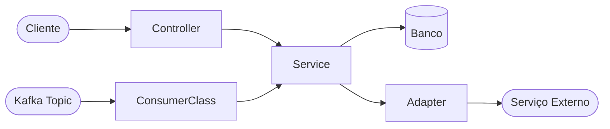

<!-- @all -->
# sdd-setup-project — Discovery e Documentação do Projeto

Analisa um projeto do workspace, preenche toda a estrutura de docs do kit SDD e gera um índice de navegação DeepWiki para onboarding rápido.

O usuário invoca este agente no projeto aberto:
```
/sdd-setup-project
```

Resolva o diretório atual como `PROJECT` pelo contexto do runtime.

---

## Etapa 0 — Verificação do Kit SDD

1. Verifique se o kit SDD está disponível com `sdd doctor --scope user --json`.
2. Se não estiver disponível: informe ao usuário e sugira executar `sdd install --scope user` fora do projeto antes de prosseguir.
3. Se estiver instalado: leia as instruções e documentação existentes no projeto, quando houver, e prossiga.

---

## Etapa 1 — Discovery do Projeto (Análise de Código-Fonte)

Leia os seguintes arquivos **em paralelo**:

### 1.1 — Metadados e Build

- `PROJECT/pom.xml` → `artifactId`, `groupId`, versão Java, versão Spring Boot, dependências principais
- `PROJECT/package.json` (se existir) → name, version, dependencies
- `PROJECT/build.gradle` (se existir) → alternativo ao pom.xml

### 1.2 — Configuração e Infra

- `PROJECT/src/main/resources/application.yml` (ou `.properties`)
- `PROJECT/src/main/resources/application-<environment>.yml` (ou `.properties`), quando existir
- `PROJECT/helm-values/` — todos os arquivos YAML de values
- `PROJECT/docker-compose.yml` (se existir)
- `PROJECT/Dockerfile` (se existir)

### 1.3 — Estrutura de Pacotes Java

Liste recursivamente os pacotes em `PROJECT/src/main/java/`:

```bash
find PROJECT/src/main/java -name "*.java" | head -100
```

Identifique as camadas presentes:
- `controller/` ou `api/` — camada de entrada REST
- `service/` ou `domain/` — lógica de negócio
- `repository/` ou `persistence/` — persistência
- `adapter/`, `client/`, `feign/` — integrações externas
- `consumer/` ou `listener/` — consumidores Kafka/Rabbit
- `producer/` ou `publisher/` — produtores de mensagens
- `dto/`, `model/`, `entity/` — objetos de dados
- `config/` — configurações Spring

### 1.4 — Testes Existentes

- `PROJECT/src/test/java/` — estrutura e convenções de teste
- Identifique: proporção unit vs. integration, frameworks usados, cobertura estimada

### 1.5 — Pontos de Entrada

Identifique todos os pontos de entrada do sistema:
- Controllers REST: `@RestController`, `@RequestMapping` → extraia todos os endpoints
- Consumers Kafka: `@KafkaListener` → extraia tópicos consumidos
- Schedulers: `@Scheduled` → extraia frequências
- Listeners de eventos Spring: `@EventListener`

---

## Etapa 2 — Preencher Documentação de Contexto

Gere ou sobrescreva os arquivos na pasta `PROJECT/.github/docs/project-context/`:

### 2.1 — `project-overview.md`

```markdown
# Project Overview — {artifactId}

## Identificação
- **Artifact ID:** {artifactId}
- **Group ID:** {groupId}
- **Versão Java:** {version}
- **Spring Boot:** {spring-boot.version}
- **Repositório:** {remote-origin}

## Propósito
{descrição do que o serviço faz — inferida do nome, controllers e topics}

## Domínio de Negócio
{domínio identificado pelos nomes de pacotes e entidades}

## Stack Principal
| Tecnologia | Versão | Uso |
|------------|--------|-----|
| Java | {version} | Linguagem principal |
| Spring Boot | {version} | Framework |
| {db-driver} | {version} | Persistência |
| {messaging} | {version} | Mensageria |

## Pontos de Entrada
| Tipo | Endpoint/Tópico | Descrição |
|------|----------------|-----------|
| REST | {method} {path} | {descrição} |
| Kafka | {topic} | {descrição} |

## Variáveis de Ambiente Críticas
| Variável | Propósito |
|----------|-----------|
| {env-var} | {propósito} |
```

### 2.2 — `current-architecture.md`

```markdown
# Arquitetura Atual — {artifactId}

## Padrão Arquitetural
{Layered / Hexagonal / Clean — inferido da estrutura de pacotes}

## Estrutura de Camadas

\`\`\`
src/main/java/{groupId}/
├── controller/     — Endpoints REST (sem lógica de negócio)
├── service/        — Lógica de negócio
├── repository/     — Acesso a dados
├── adapter/        — Integrações externas (Feign, etc.)
├── consumer/       — Consumidores de mensagens
├── dto/            — Objetos de transferência
└── config/         — Configurações Spring
\`\`\`

## Regras de Dependência
- Controllers → Services (nunca o inverso)
- Services → Repositories, Adapters (nunca Controllers)
- Adapters → Serviços externos (Feign, Kafka, HTTP)
- Domain/Entities → sem dependências de infra

## Integrações Externas
| Sistema | Tipo | Endpoint/Tópico | Direção |
|---------|------|----------------|---------|
| {sistema} | REST/Kafka/DB | {endpoint} | inbound/outbound |
```

### 2.3 — `module-map.md`

```markdown
# Mapa de Módulos — {artifactId}

| Pacote | Responsabilidade | Classes principais |
|--------|-----------------|-------------------|
| controller | Recebe e valida requisições HTTP | {lista de controllers} |
| service | Orquestra regras de negócio | {lista de services} |
| repository | Acesso ao banco de dados | {lista de repositories} |
| adapter | Clientes externos (Feign, Kafka producer) | {lista de adapters} |
| consumer | Processamento de mensagens assíncronas | {lista de consumers} |
```

### 2.4 — `dependency-map.md`

```markdown
# Mapa de Dependências — {artifactId}

## Dependências de Runtime (pom.xml)

| Dependência | Versão | Propósito |
|-------------|--------|-----------|
| spring-boot-starter-web | {version} | API REST |
| spring-data-jpa | {version} | ORM / banco |
| {kafka-client} | {version} | Mensageria |
| {feign} | {version} | HTTP clients |

## Dependências de Teste

| Dependência | Versão | Propósito |
|-------------|--------|-----------|
| spring-boot-starter-test | {version} | JUnit + Mockito |
| {testcontainers} | {version} | Testes de integração |

## Dependências de Serviços Externos

| Serviço | URL/Tópico | Crítico? |
|---------|-----------|---------|
| {serviço} | {endpoint} | ✅ Sim / ❌ Não |
```

### 2.5 — Gerar diagramas Mermaid em `PROJECT/.github/docs/diagrams/`

**`architecture-overview.md`** — Diagrama de fluxo principal:



**`sequence-main-flow.md`** — Sequência do fluxo principal (inferido dos controllers e services).

---

## Etapa 3 — Preencher Documentação de Arquitetura

Gere os arquivos em `PROJECT/.github/docs/architecture/`:

### 3.1 — `overview.md` (se não existir)

Documente o padrão arquitetural inferido, as camadas, as regras de dependência e os padrões observados no código.

### 3.2 — `tech-stack.md` (se não existir)

Documente a stack completa extraída do `pom.xml` e configurações.

---

## Etapa 4 — Preencher Documentação de Testing e Operations

### 4.1 — `PROJECT/.github/docs/testing/testing-strategy.md`

```markdown
# Estratégia de Testes — {artifactId}

## Stack de Testes
| Tipo | Framework | Localização |
|------|-----------|-------------|
| Unitário | JUnit 5 + Mockito | src/test/java/ |
| Controller | @WebMvcTest + MockMvc | src/test/java/.../controller/ |
| Integração | {testcontainers/WireMock} | src/test/java/.../integration/ |

## Convenções
- Nomenclatura: `metodo_cenario_comportamentoEsperado`
- Unitários: `@ExtendWith(MockitoExtension.class)` — sem Spring context
- Controllers: `@WebMvcTest` — sem `@SpringBootTest`
- Usar `@MockitoBean` (não `@MockBean` — deprecated)

## Cobertura Estimada
{inferida dos arquivos de teste encontrados}
```

### 4.2 — Perguntar sobre estratégia de testes adicionais

Ao finalizar as etapas anteriores, pergunte:

> Os docs de contexto foram gerados. Deseja iniciar uma estratégia de testes agora?
> - **I** — executar `/sdd-generate-integration-tests` para fluxos de integração BDD/Cypress
> - **E** — executar `/sdd-generate-e2e-tests TICKET --plan` para jornadas web Playwright
> - **N** — encerrar aqui; o bootstrap poderá usar `e2e:auto` durante uma demanda

Não trate integração backend e automação de navegador como o mesmo fluxo. Se o
projeto já adota Cypress ou outro framework E2E, a opção **E** deve primeiro
executar discovery e relatar o conflito, sem instalar Playwright automaticamente.

---

## Etapa 5 — Gerar Índice de Navegação DeepWiki

Gere o arquivo `PROJECT/.github/docs/index.md` como ponto de entrada único do conhecimento do projeto:

```markdown
# {artifactId} — Knowledge Index

> Gerado automaticamente pelo sdd-setup-project em {data}

## Visão Rápida

| Campo | Valor |
|-------|-------|
| **Propósito** | {propósito em uma linha} |
| **Stack** | Java {version} + Spring Boot {version} |
| **Banco** | {banco} |
| **Mensageria** | {kafka/rabbit/nenhum} |
| **Endpoints** | {N} endpoints REST |
| **Tópicos** | {N} tópicos Kafka |

## Navegação por Documentos

### Contexto do Projeto
- [Visão Geral](project-context/project-overview.md) — o que o serviço faz e por quê
- [Arquitetura Atual](project-context/current-architecture.md) — padrão, camadas, regras
- [Mapa de Módulos](project-context/module-map.md) — responsabilidades por pacote
- [Mapa de Dependências](project-context/dependency-map.md) — libs e serviços externos

### Arquitetura e Decisões
- [Overview Arquitetural](architecture/overview.md)
- [Tech Stack](architecture/tech-stack.md)
- [ADRs](architecture/decisions/) — decisões arquiteturais registradas

### Diagramas
- [Arquitetura Geral](diagrams/architecture-overview.md)
- [Fluxo Principal](diagrams/sequence-main-flow.md)

### Testes e Operações
- [Estratégia de Testes](testing/testing-strategy.md)
- [Testes de Integração](testing/integration-tests.md)

### Demandas (Specs)
- [Specs Abertas](specs/) — uma subpasta por ticket (JT-XXXX/)

## Fluxo de Trabalho SDD

\`\`\`
/sdd-create-spec TICKET             → scaffold da demanda
/sdd-analyze-demand TICKET          → análise de documentos
/sdd-implement-spec TICKET          → implementação com TDD
/sdd-generate-integration-tests     → testes E2E Cypress
/sdd-generate-e2e-tests             → jornadas web Playwright no projeto consumidor
/sdd-review-code                    → revisão estruturada
/sdd-update-documentation           → atualização dos docs
\`\`\`
```

---

## Resumo Final

Ao concluir, apresente:

```
✅ sdd-setup-project concluído para: PROJECT

Arquivos gerados:
  .github/docs/project-context/project-overview.md
  .github/docs/project-context/current-architecture.md
  .github/docs/project-context/module-map.md
  .github/docs/project-context/dependency-map.md
  .github/docs/architecture/overview.md
  .github/docs/architecture/tech-stack.md
  .github/docs/testing/testing-strategy.md
  .github/docs/diagrams/architecture-overview.md
  .github/docs/diagrams/sequence-main-flow.md
  .github/docs/index.md

Próximo passo sugerido:
  /sdd-create-spec <TICKET>  — iniciar uma demanda
```

---

## Regras

- Nunca inventar informações não evidenciadas no código ou configurações lidas.
- Se uma informação não puder ser inferida, preencha com `TODO — não identificado automaticamente`.
- Não implementar código de produção.
- Não modificar `copilot-instructions.md` ou `AGENTS.md` — apenas ler.
- Se arquivos de contexto já existirem, **sobrescreva** com base na análise atual (não concatene).
- Preserve o formato Mermaid — não use syntax incorreta que quebre o render.
<!-- @end -->
