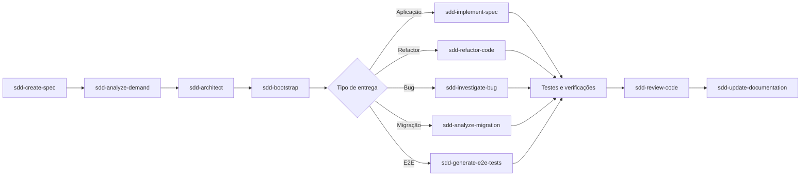

# Catálogo de agentes

Os 17 agentes são escritos em `agents/` e compilados para todos os runtimes.
Todos devem resolver contexto pela CLI, respeitar capabilities declaradas e
preservar a revisão humana nos gates.

O contrato comum está em [AGENT-CONTRACT.md](AGENT-CONTRACT.md): contexto
canônico, classificação entre agentes de demanda e de apoio, capabilities versus
efeitos reais, envelope `AGENT_RESULT` e chave `payload` de cada agente. A
política operacional vive em `templates/agent-policy.md` e é injetada pelo
compilador no final de todo agente compilado, nos quatro runtimes.

## Como os agentes cooperam

`sdd-architect` é o ponto de aprofundamento técnico: ele define impacto,
trade-offs, arquivos afetados, riscos e evidências antes de o bootstrap escolher
o agente que produz a entrega. `sdd-read-document`, `sdd-setup-project`,
`sdd-install-sdd-kit` e `sdd-workspace-sync` são agentes de apoio e podem ser
acionados conforme a necessidade, sem pular os gates.

| Grupo | Agentes |
|---|---|
| Orquestração | `sdd-bootstrap`, `sdd-architect`, `sdd-create-spec`, `sdd-analyze-demand` |
| Entrega | `sdd-implement-spec`, `sdd-refactor-code`, `sdd-investigate-bug`, `sdd-analyze-migration` |
| Testes | `sdd-generate-tests`, `sdd-generate-integration-tests`, `sdd-generate-e2e-tests` |
| Revisão e documentação | `sdd-review-code`, `sdd-update-documentation`, `sdd-read-document` |
| Setup e operação | `sdd-setup-project`, `sdd-install-sdd-kit`, `sdd-workspace-sync` |

## Resultado dos agentes

Nenhum agente de execução escreve `session-state.md`. Cada agente devolve um
`AGENT_RESULT` validável por `sdd result validate --file <resultado> --json`, e
o `sdd-bootstrap` consolida o estado a partir de resultados validados. Testes ou
builds não executados são registrados como `not-run`; falhas anteriores à
demanda vão em `preexisting_failures`.

## Regras de integração

- Edite apenas `agents/*.md`; nunca altere `dist/` manualmente.
- A versão do agente acompanha o `VERSION` do toolkit; `sdd lint` falha em caso
  de divergência.
- Recompile com `python scripts/sdd_compile.py --runtime all` e regenere o
  inventário com `python scripts/build_inventory.py --write dist/build-manifest.json`.
- Execute `sdd lint --json`, os testes e a validação de conteúdo público.
- O arquiteto produz ou revisa artefatos de spec; não implementa código de
  produção diretamente.

As capabilities `read`, `write`, `terminal` e `questions` são declaradas no
frontmatter e propagadas para os quatro runtimes. O compilador reduz as tools do
Copilot conforme essa declaração, e o linter recusa um agente que instrua um
efeito fora das capabilities que declara.
