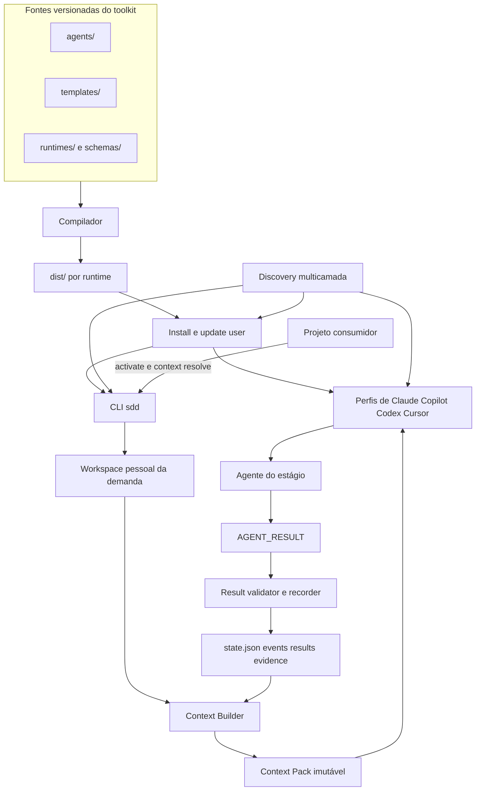
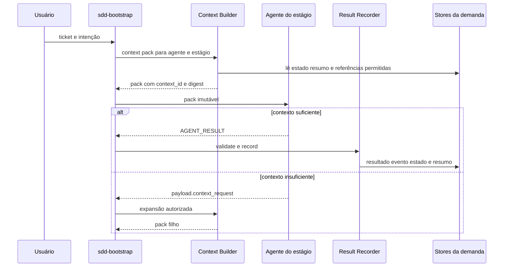
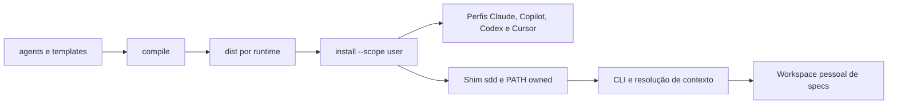
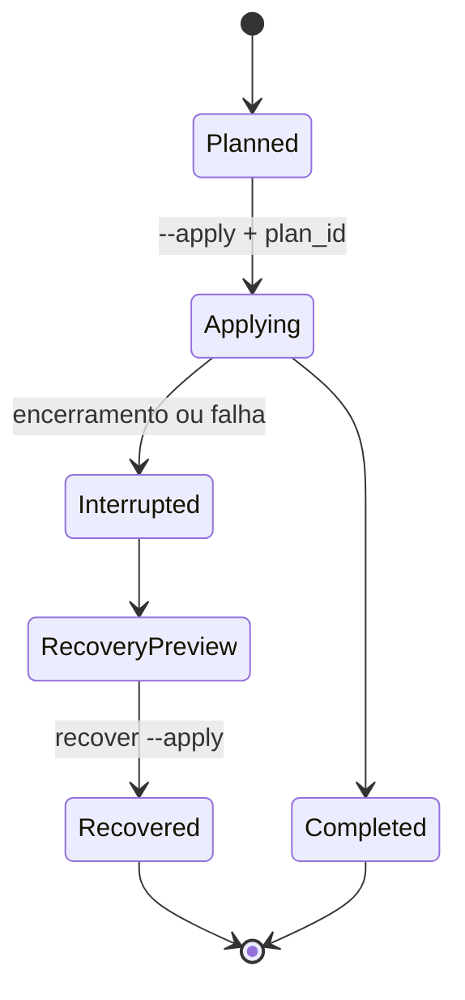

# Arquitetura do SDD Toolkit

## Componentes

Os arquivos em `agents/` são a fonte canônica. O compilador gera artefatos para
Claude, Copilot, Codex e Cursor; `dist/` não deve ser alterado manualmente.

`Discovery multicamada` correlaciona comandos no PATH, extensões e perfis de
editores, package managers e metadados locais do sistema. O resultado mantém
separados CLI, extensão, aplicativo desktop e destino de assets; logo, não
confunde uma extensão instalada com uma CLI utilizável. O scan padrão é passivo;
o probe de versão exige modo explícito e usa somente argumentos fixos.

## Orquestração de uma demanda

O bootstrap é o único componente que cria packs, aprova expansões e muda o
estado. Um agente não transfere contexto diretamente a outro agente: ele
produz um resultado validável e o próximo pack seleciona somente o delta útil.

## Fluxo de distribuição

O projeto consumidor entra somente em `activate` e `context resolve`; agentes,
skills e estado não são instalados nele.

## Escopos

- `user`: instalação e estado fora do projeto; é o único fluxo local suportado.
- `organization`: permanece bloqueado até existir provider com autenticação,
  aprovação e rollback auditável.

## Contratos principais

| Contrato | Finalidade |
|---|---|
| `context-resolution` | Resolve projeto, runtime, workspace e spec sem o agente adivinhar paths. |
| `delivery-contract` | Define o tipo de entrega e as verificações necessárias. |
| `architecture-contract` | Define impacto, design técnico e evidências arquiteturais. |
| `context-pack` | Vincula agente, ticket, referências, orçamento, digest e omissões explícitas. |
| `agent-result` | Registra saída compacta, evidências e proveniência do pack consumido. |
| `transaction-plan` e `transaction-journal` | Protegem install, update e uninstall user. |

Os schemas ficam em `schemas/` e devem falhar fechados para versão, campo ou
path não suportado.

## Estado e recuperação

O lifecycle user usa plano identificado por hash, lock e journal persistente.
Uma operação incompleta bloqueia novas alterações até `sdd transaction recover`
ser revisado e aplicado. O rollback restaura somente itens comprovadamente
gerenciados e preserva mudanças do usuário como conflito.

Cada etapa registra no journal apenas os alvos e hashes que pertencem à operação.
Isso permite recuperar assets, shim, PATH e manifest sem apagar alterações externas.

O journal de instalação é independente do estado de uma demanda. Para o segundo,
`state.json` guarda apenas o presente, `events.ndjson` registra a sequência e
`results/` / `evidence/` preservam a auditoria.

Consulte [USER-SCOPE.md](USER-SCOPE.md) para comandos e
[FILES-AND-LIFECYCLE.md](FILES-AND-LIFECYCLE.md) para ownership.
