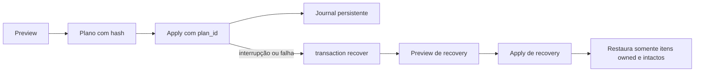

# Arquivos e lifecycle user

O SDD Toolkit não instala agentes, skills, manifestos ou configuração no
repositório do projeto. A instalação ocorre exclusivamente no perfil do usuário
e o vínculo com um projeto é registrado no estado local.

| Local | Conteúdo | Política |
|---|---|---|
| Perfil do runtime | agentes e skills compilados | somente itens com owner e hash SDD são alterados |
| Estado local do SDD Toolkit | activation, source, instalação e journal | escrita atômica e recovery antes de nova operação |
| Workspace user | specs e `session-state.md` | fora do repositório consumidor |
| Shim e PATH | comando `sdd`, quando solicitado | removidos apenas se comprovadamente owned |

`install`, `update` e `uninstall` usam preview por padrão. Arquivos modificados,
desconhecidos ou pertencentes a outro runtime são preservados como conflito.



O mesmo plano cobre assets, shim, PATH e manifest. Se algum alvo tiver sido
modificado fora do toolkit, ele é reportado como conflito e fica preservado.

```bash
sdd install --scope user --runtime all --apply --json
sdd doctor --scope user --json
sdd transaction status --scope user --active-only --json
sdd uninstall --scope user --apply --json
```

Para associar uma demanda a um projeto, use `sdd activate --scope user` e
`sdd context resolve`; essas operações não escrevem no projeto.
