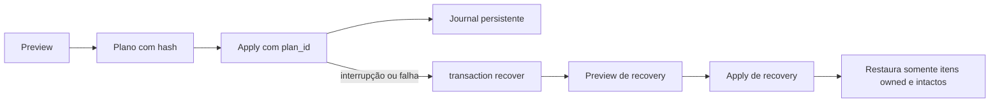
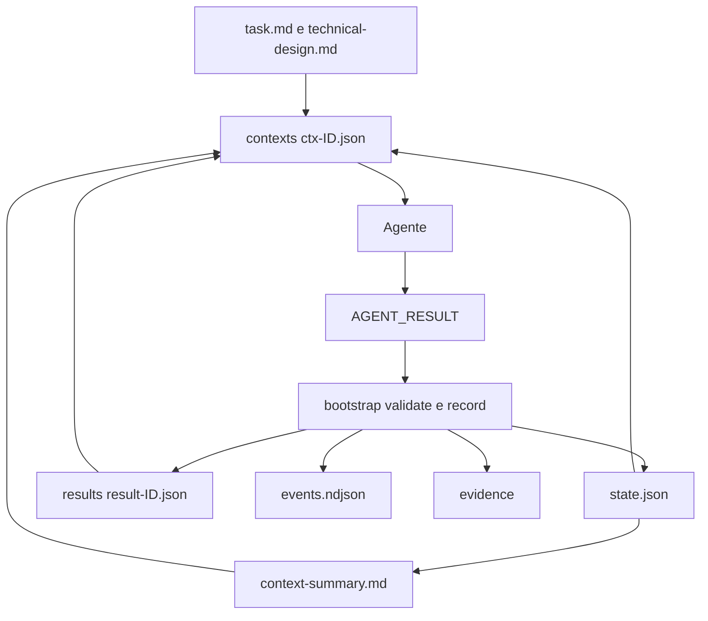

# Arquivos e lifecycle user

O SDD Toolkit não instala agentes, skills, manifestos ou configuração no
repositório do projeto. A instalação ocorre exclusivamente no perfil do usuário
e o vínculo com um projeto é registrado no estado local.

| Local | Conteúdo | Política |
|---|---|---|
| Perfil do runtime | agentes e skills compilados | somente itens com owner e hash SDD são alterados |
| Estado local do SDD Toolkit | activation, source, instalação e journal | escrita atômica e recovery antes de nova operação |
| Workspace user | specs, `task.md`, packs, estado, resultados e evidências | fora do repositório consumidor; apenas o `sdd-bootstrap` registra a orquestração |
| Shim e PATH | comando `sdd`, quando solicitado | removidos apenas se comprovadamente owned |

`install`, `update` e `uninstall` usam preview por padrão. Arquivos modificados,
desconhecidos ou pertencentes a outro runtime são preservados como conflito.



O mesmo plano cobre assets, shim, PATH e manifest. Se algum alvo tiver sido
modificado fora do toolkit, ele é reportado como conflito e fica preservado.

```bash
sdd install --scope user --runtime all --apply --json
sdd doctor --scope user --json
sdd transaction status --scope user --active-only --json
sdd uninstall --scope user --apply --json
```

Para associar uma demanda a um projeto, use `sdd activate --scope user` e
`sdd context resolve`; essas operações não escrevem no projeto.

`task.md` é o artefato funcional de uma demanda. `state.json` é o estado
canônico; `events.ndjson` é o histórico append-only; `results/` e `evidence/`
retêm auditoria; `context-summary.md` e `session-state.md` são visões humanas
geradas. O bootstrap cria packs em `contexts/` e os agentes recebem somente o
pack do seu estágio. Os agentes derivam `PROJECT_PATH`, `SDD_WORKSPACE`,
`SPEC_PATH` e `RUNTIME` do JSON de `sdd context resolve` e confirmam que todo
destino de escrita está contido em `PROJECT_PATH` ou `SPEC_PATH`. Veja
[AGENT-CONTRACT.md](AGENT-CONTRACT.md).


