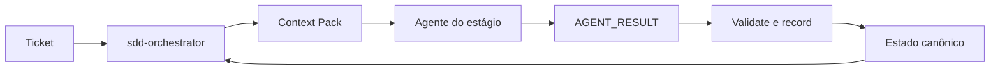
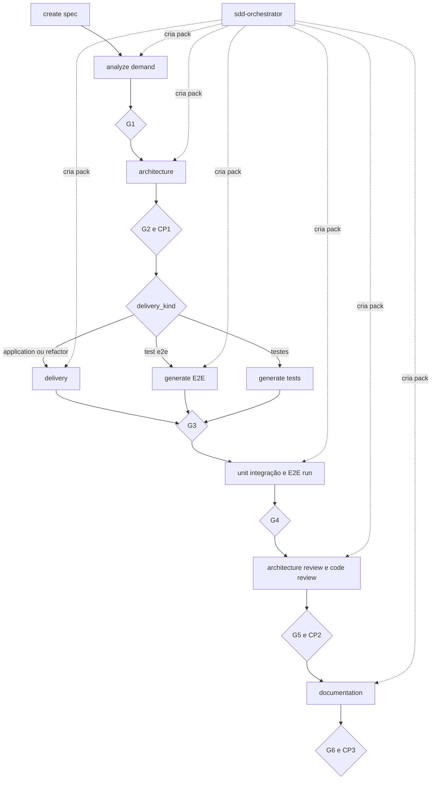
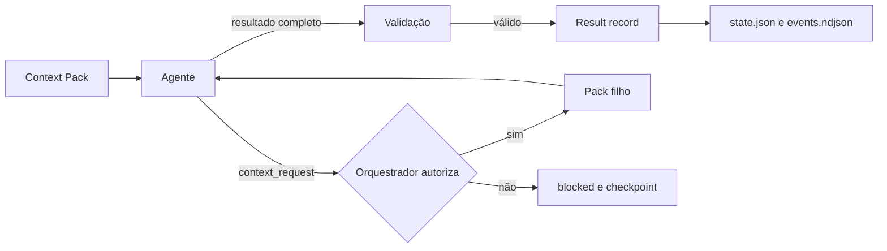
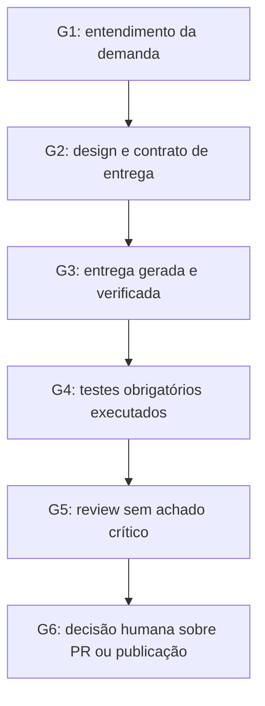

# Pipeline, gates e E2E

## Fluxo base



`analyze`, `architecture` e `delivery` são etapas core. Testes, E2E, review e
documentação podem seguir a política configurada, mas uma etapa desabilitada não
autoriza declarar uma verificação como executada.

## Visualização do fluxo



Os losangos são gates: se faltarem evidências, o fluxo retorna à etapa que as
produz. O agente não pode converter uma etapa ignorada em sucesso declarado.

## Gates

| Gate | Evidência principal |
|---|---|
| G1 | demanda, critérios e riscos compreendidos |
| G2 | Technical Design, arquivos afetados, delivery e verification aprovados |
| G3 | entrega validada com evidência real |
| G4 | testes e verificações declaradas concluídos |
| G5 | review arquitetural e de código sem achado crítico aberto |
| G6 | resumo e decisão humana sobre publicação/PR |

As políticas `auto`, `confirm` e `skip` são resolvidas pelo orquestrador a partir
das flags, do estado da demanda e do perfil padrão. Um gate automático precisa
de evidência do runtime atual; estado herdado não é aceito como sucesso
automático.

A evidência de cada gate chega ao orquestrador como um `AGENT_RESULT`, descrito em
[AGENT-CONTRACT.md](AGENT-CONTRACT.md). O orquestrador valida cada resultado com
`sdd result validate --file <resultado> --json` antes de persistir o estado.
Evidência `not-run`, `failed`, `flaky` ou `blocked` não aprova gate, e nenhum
perfil — incluindo `permissive` — autoriza rede, instalação, commit, push, PR ou
publicação sem autorização explícita na mesma sessão.





## Arquitetura por demanda

Antes de G2, o toolkit classifica a demanda como `low`, `medium` ou `high`.
Mudanças de autenticação, dados, APIs, eventos, compatibilidade ou disponibilidade
devem resultar em design proporcional e, quando necessário, ADR.

```bash
sdd architecture propose --type feature --description "Adicionar paginação" --json
sdd architecture validate --task /caminho/task.md --json
```

## Projeto novo como demanda

`greenfield` é o tipo para um projeto criado do zero, e não um pipeline
separado: análise, arquitetura, entrega, testes, review e documentação seguem
iguais. O que muda é onde mora a decisão.

Num repositório existente o stack é descoberto por evidência. Num projeto novo
não existe evidência para descobrir, então a **fundação** — linguagem,
framework, build, framework de teste, layout e a skill de stack que governa a
entrega — é decidida pelo `sdd-architect` e registrada na tabela Foundation
Decision do `task.md`.

Por isso `greenfield` classifica como impacto `high` de forma incondicional:
a escolha não é revertida na prática, então nunca cai em design curto e sempre
passa por checkpoint humano antes da entrega.

```bash
sdd delivery propose --type greenfield --description "Criar o serviço de cobranças" --json
```

O `delivery_kind` continua `application` e a entrega continua com
`sdd-implement-spec`, com uma diferença: sem baseline, o alvo é o menor
esqueleto que compila, roda e tem um teste passando. Com a fundação `pending`,
o implementador bloqueia em vez de escolher a stack por conta própria.

Depois do primeiro scaffold o projeto passa a ser existente, e o
`sdd-setup-project` volta a ser útil da segunda demanda em diante.

## E2E como entrega

`test-e2e` significa que a suíte é a entrega principal: o orquestrador usa
`sdd-generate-e2e-tests --generate`, não `sdd-implement-spec`. A geração e a
execução são evidências distintas; somente a execução aprovada pode satisfazer
o G4 quando E2E é obrigatório.

Os testes Playwright ou Cypress são criados no projeto consumidor. O toolkit não
instala browsers, `package.json` ou um projeto E2E em sua própria raiz.
