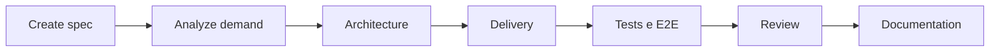
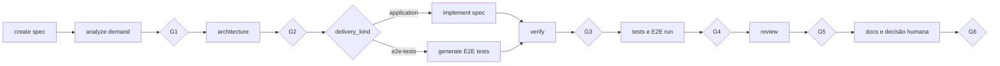
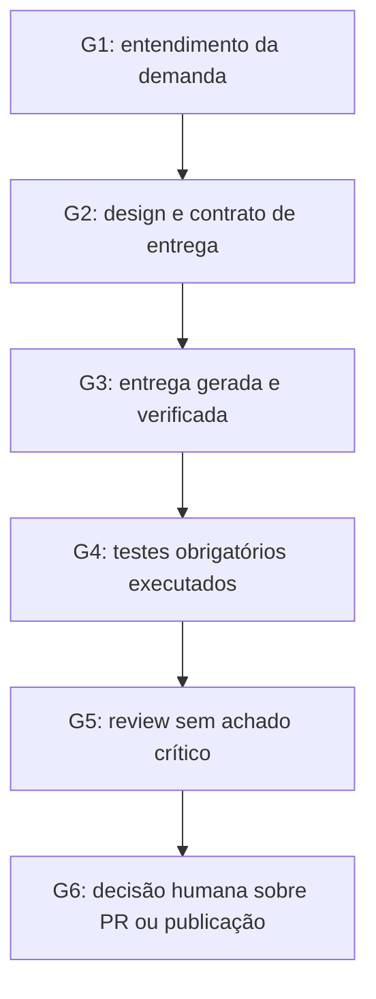

# Pipeline, gates e E2E

## Fluxo base



`analyze`, `architecture` e `delivery` são etapas core. Testes, E2E, review e
documentação podem seguir a política configurada, mas uma etapa desabilitada não
autoriza declarar uma verificação como executada.

## Visualização do fluxo



Os losangos são gates: se faltarem evidências, o fluxo retorna à etapa que as
produz. O agente não pode converter uma etapa ignorada em sucesso declarado.

## Gates

| Gate | Evidência principal |
|---|---|
| G1 | demanda, critérios e riscos compreendidos |
| G2 | Technical Design, arquivos afetados, delivery e verification aprovados |
| G3 | entrega validada com evidência real |
| G4 | testes e verificações declaradas concluídos |
| G5 | review arquitetural e de código sem achado crítico aberto |
| G6 | resumo e decisão humana sobre publicação/PR |

As políticas `auto`, `confirm` e `skip` são resolvidas pelo bootstrap a partir
das flags, do estado da demanda e do perfil padrão. Um gate automático precisa
de evidência do runtime atual; estado herdado não é aceito como sucesso
automático.



## Arquitetura por demanda

Antes de G2, o toolkit classifica a demanda como `low`, `medium` ou `high`.
Mudanças de autenticação, dados, APIs, eventos, compatibilidade ou disponibilidade
devem resultar em design proporcional e, quando necessário, ADR.

```bash
sdd architecture propose --type feature --description "Adicionar paginação" --json
sdd architecture validate --task /caminho/task.md --json
```

## E2E como entrega

`test-e2e` significa que a suíte é a entrega principal: o bootstrap usa
`sdd-generate-e2e-tests --generate`, não `sdd-implement-spec`. A geração e a
execução são evidências distintas; somente a execução aprovada pode satisfazer
o G4 quando E2E é obrigatório.

Os testes Playwright ou Cypress são criados no projeto consumidor. O toolkit não
instala browsers, `package.json` ou um projeto E2E em sua própria raiz.
