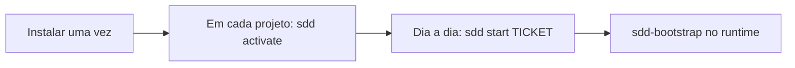

# SDD Toolkit — início rápido

O SDD Toolkit é instalado uma vez no perfil do usuário. Depois, cada projeto é
ativado uma única vez e as demandas são iniciadas pelo ticket. O toolkit nunca
cria agentes, skills ou configurações no repositório consumidor.



## 1. Instalar no perfil do usuário

Pré-requisitos: Python 3.9+, Git e pelo menos um dos runtimes suportados.

Faça primeiro o preview:

```powershell
.\install.ps1 -DryRun
```

```bash
bash install.sh --dry-run
```

> **Importante:** o preview não instala nada. Se os destinos e conflitos
> estiverem corretos, execute obrigatoriamente o instalador sem `-DryRun` ou
> `--dry-run` para instalar o comando `sdd` e os assets dos runtimes:

```powershell
.\install.ps1 -Runtime all
```

```bash
bash install.sh --runtime=all
```

O instalador configura o comando `sdd`, instala os assets nos perfis dos
runtimes disponíveis e preserva arquivos que não pertençam ao toolkit.

Abra um novo terminal e valide:

```bash
sdd --version
sdd runtime detect --mode quick --redact-paths --json
sdd doctor --scope user --json
```

Para limitar os assets a um runtime, use `-Runtime codex` no Windows ou
`--runtime=codex` no Unix. `--profile-root`, `--install-root`, `--no-path` e
instalação por Git são opções de ambiente avançado; veja [USER-SCOPE.md](USER-SCOPE.md).

## 2. Ativar o projeto atual

Abra a raiz do seu projeto e execute somente:

```bash
sdd activate
```

O comando usa a raiz Git quando ela existe, registra o vínculo no perfil do
usuário e cria o workspace pessoal de specs. Não altera nenhum arquivo do projeto.

Para revisar antes de gravar o registro, use:

```bash
sdd activate --dry-run
```

Confirme o estado a qualquer momento:

```bash
sdd status
sdd activation list
```

## 3. Iniciar ou retomar uma demanda

Ainda na raiz do projeto, informe apenas o ticket:

```bash
sdd start ABC-123
sdd resume ABC-123
```

`start` retorna o workspace, a pasta da spec e o handoff para `sdd-bootstrap`.
Se o projeto ainda não estiver ativo, execute `sdd activate` ou use `--yes` em
automação para autorizar a ativação local. `resume` sem ticket só funciona quando
há uma única demanda retomável.

No chat do runtime, selecione ou solicite o agente `sdd-bootstrap` e entregue o
ticket. O agente resolve o contexto pelo diretório aberto e conduz análise,
arquitetura, entrega, testes, review e documentação conforme os gates.

```text
Use sdd-bootstrap para iniciar a demanda ABC-123 neste projeto.
```

## 4. Rotina diária

| Intenção | Comando | Resultado |
|---|---|---|
| Ver o trabalho atual | `sdd status` | ativação, workspace, tickets e próximo passo |
| Iniciar demanda | `sdd start ABC-123` | handoff para o bootstrap |
| Retomar demanda | `sdd resume ABC-123` | handoff para a spec existente |
| Ver contexto técnico | `sdd context resolve --ticket ABC-123 --json` | paths e perfil para automação/agentes |
| Diagnosticar instalação | `sdd doctor --scope user --json` | assets, versões e capabilities |
| Atualizar assets | `sdd update --scope user --apply --json` | preview/apply transacional |
| Recuperar interrupção | `sdd transaction recover --scope user --apply --json` | recovery de assets, shim, PATH e manifest |

## Uso em cada runtime

Os assets ficam no perfil do usuário; abra o projeto consumidor normalmente e
inicie o agente `sdd-bootstrap` com o ticket. Os detalhes e a evidência de
compatibilidade ficam nos guias abaixo:

| Runtime | Guia | Local dos assets |
|---|---|---|
| GitHub Copilot | [COPILOT.md](runtimes/COPILOT.md) | `~/.copilot/agents` e `~/.copilot/skills` |
| Claude Code | [CLAUDE-CODE.md](runtimes/CLAUDE-CODE.md) | `~/.claude/agents` e `~/.claude/skills` |
| Codex | [CODEX.md](runtimes/CODEX.md) | `~/.codex/agents` e `~/.agents/skills` |
| Cursor | [CURSOR.md](runtimes/CURSOR.md) | `~/.cursor/agents` e `~/.agents/skills` |

Cada guia separa o fluxo comum das particularidades que ainda exigem validação
com a versão real do harness. Não copie agentes para `.github`, `.claude`,
`.codex` ou `.cursor` dentro do projeto.

## Se um runtime não for encontrado

Uma extensão, um aplicativo desktop e uma CLI são componentes diferentes. Antes
de reinstalar qualquer produto, execute:

```bash
sdd runtime detect --mode full --redact-paths --json
```

O relatório mostra se o editor, a extensão, a CLI e o destino de assets foram
encontrados. `quick` é passivo e seguro para diagnóstico cotidiano; `full` faz
probes locais limitados para confirmar versões. Consulte a
[referência da CLI](CLI-REFERENCE.md#descoberta-de-runtimes) para os limites de
cada modo.
