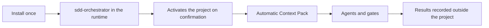

# SDD Toolkit — Quickstart

<strong>English</strong> · <a href="./QUICKSTART.pt-BR.md">Português&nbsp;(BR)</a>

The SDD Toolkit is installed once into your user profile. After that, each
project is activated once and demands are started by ticket. The toolkit never
creates agents, skills or configuration inside the consumer repository.



Once installed, the flow happens inside the runtime: ask `sdd-orchestrator` for
the demand and it handles activation. The terminal commands in sections 3 and 4
remain valid and are the preferred path for automation and CI.

## 1. Install into your user profile

Prerequisites: Python 3.9+, Git and at least one supported runtime.

Preview first:

```powershell
.\install.ps1 -DryRun
```

```bash
bash install.sh --dry-run
```

> [!IMPORTANT]
> The preview installs nothing. If the destinations and conflicts look right,
> you **must** run the installer again without `-DryRun` / `--dry-run` to
> install the `sdd` command and the runtime assets:

```powershell
.\install.ps1 -Runtime all
```

```bash
bash install.sh --runtime=all
```

The installer configures the `sdd` command, installs assets into the profiles
of the runtimes it finds, and preserves any file it does not own.

Open a new terminal and validate:

```bash
sdd --version
sdd runtime detect --mode quick --redact-paths --json
sdd doctor --scope user --json
```

To limit assets to one runtime, use `-Runtime codex` on Windows or
`--runtime=codex` on Unix. `--profile-root`, `--install-root`, `--no-path` and
Git-based installation are advanced options; see [USER-SCOPE.md](USER-SCOPE.md).

## 2. Start the demand from the runtime

Open the project in your runtime and ask `sdd-orchestrator` for the demand:

```text
Use sdd-orchestrator to start ticket PAY-142 in this project.
```

If the project is not active yet, the orchestrator shows the project path, the
workspace it will create and the fact that nothing is written to the
repository, asks for your confirmation, and activates. Activation changes
profile state, so it never happens without explicit consent.

```text
You          Use sdd-orchestrator to start ticket PAY-142 in this project.

Orchestrator This project is not active yet.
               project:   /path/to/your-project
               workspace: ~/sdd-history-implementations/your-project-a1b2/.../specs
               nothing will be written to the repository
             May I activate it?

You          yes

Orchestrator Activated. Analyzing the demand...
             G1 (demand understood): passed
             Delivery Strategy: application, verification [unit]
             Next: architecture. Confirm the strategy?
```

From there it resolves the context, builds a Context Pack before each agent,
and runs analysis, architecture, delivery, tests, review and documentation
through the gates — stopping at each checkpoint for your decision. It never
commits, pushes or publishes on its own.

To resume, swap the verb:

```text
Use sdd-orchestrator to resume ticket PAY-142 in this project.
```

## 3. Activate from the terminal (automation and CI)

The equivalent path outside the runtime. From your project root:

```bash
sdd activate
```

The command uses the Git root when one exists, records the link in your user
profile and creates your personal spec workspace. It does not change any file
in the project.

To review before writing the record:

```bash
sdd activate --dry-run
```

Check the state at any time:

```bash
sdd status
sdd activation list
```

## 4. Start or resume from the terminal

Still at the project root, pass only the ticket:

```bash
sdd start PAY-142
sdd resume PAY-142
```

`start` returns the workspace, the spec folder and the handoff for
`sdd-orchestrator`. If the project is not active yet, run `sdd activate` or use
`--yes` to authorize local activation in the same call. `resume` without a
ticket only works when there is exactly one resumable demand.

## 5. Daily routine

| Intent | Command | Result |
|---|---|---|
| See current work | `sdd status` | activation, workspace, tickets and next step |
| Start a demand | `sdd start PAY-142` | handoff to the orchestrator |
| Resume a demand | `sdd resume PAY-142` | handoff to the existing spec |
| See technical context | `sdd context resolve --ticket PAY-142 --json` | paths and profile for automation/agents |
| Diagnose the installation | `sdd doctor --scope user --json` | assets, versions and capabilities |
| Update assets | `sdd update --scope user --apply --json` | transactional preview/apply |
| Recover an interruption | `sdd transaction recover --scope user --apply --json` | recovery of assets, shim, PATH and manifest |

## Usage in each runtime

The prompt is the same in all four runtimes, because the agents are installed
into your user profile. Open the consumer project normally and type in the
chat. **Never copy agents into `.github`, `.claude`, `.codex` or `.cursor`
inside the project.**

### Claude Code

Open the project and type in the chat:

```text
Use sdd-orchestrator to start ticket PAY-142 in this project.
```

Assets in `~/.claude/agents` and `~/.claude/skills`. Because they live in
`~/.claude/agents`, Claude Code recognizes them as subagents and can dispatch
tests and review in parallel when the harness version offers it. Guide:
[CLAUDE-CODE.md](runtimes/CLAUDE-CODE.md).

### GitHub Copilot

In VS Code, open the project and type in the Copilot chat:

```text
Use sdd-orchestrator to start ticket PAY-142 in this project.
```

Assets in `~/.copilot/agents` and `~/.copilot/skills`. The chat may also offer
the SDD agent in a picker. Guide: [COPILOT.md](runtimes/COPILOT.md).

### Cursor

Open the project and type in the Cursor chat:

```text
Use sdd-orchestrator to start ticket PAY-142 in this project.
```

Agents in `~/.cursor/agents`; shared skills in `~/.agents/skills`. Guide:
[CURSOR.md](runtimes/CURSOR.md).

### Codex

Open the Codex session at the project root and ask:

```text
Use sdd-orchestrator to start ticket PAY-142 in this project.
```

Agents in `~/.codex/agents` as TOML; skills in `~/.agents/skills`. Guide:
[CODEX.md](runtimes/CODEX.md).

### About agent selection

> [!NOTE]
> The exact way to select an agent (menu, `@`, command) varies by client
> version and still depends on manual validation — see
> [HARNESS-VALIDATION.md](HARNESS-VALIDATION.md). The plain-language request
> above works everywhere and does not depend on that validation.

## Example requests

All of these work in any of the four runtimes.

Start an ordinary demand:

```text
Use sdd-orchestrator to start ticket PAY-142 in this project.
The charge endpoint must be idempotent: a repeated request with the same
key returns the original result instead of charging twice.
```

Create a project from scratch:

```text
Use sdd-orchestrator to start ticket PAY-001, type greenfield.
Create a service that receives billing requests and returns processing status.
Our team runs Linux with containers.
```

The foundation — language, framework, build tool, test framework and the stack
skill — is decided during the architecture stage, with compared alternatives,
and always goes through human approval before any code.

Resume a stalled demand:

```text
Use sdd-orchestrator to resume ticket PAY-142 in this project.
```

Call an agent directly, skipping orchestration:

```text
Use sdd-review-code to review the delivery for ticket PAY-142.
Use sdd-investigate-bug to investigate the failure in ticket PAY-207.
Use sdd-generate-tests to cover the delivery for ticket PAY-142.
```

The full catalog is in [AGENTS.md](AGENTS.md).

## If a runtime is not found

An extension, a desktop app and a CLI are different components. Before
reinstalling any product, run:

```bash
sdd runtime detect --mode full --redact-paths --json
```

The report shows whether the editor, the extension, the CLI and the asset
destination were found. `quick` is passive and safe for everyday diagnosis;
`full` performs limited local probes to confirm versions. See the
[CLI reference](CLI-REFERENCE.md#descoberta-de-runtimes) for the limits of each
mode.
