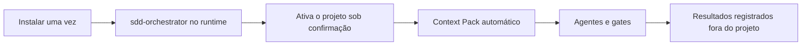

# SDD Toolkit — início rápido

<a href="./QUICKSTART.md">English</a> · <strong>Português&nbsp;(BR)</strong>

O SDD Toolkit é instalado uma vez no perfil do usuário. Depois, cada projeto é
ativado uma única vez e as demandas são iniciadas pelo ticket. O toolkit nunca
cria agentes, skills ou configurações no repositório consumidor.



Depois da instalação, o fluxo acontece dentro do runtime: peça a demanda ao
`sdd-orchestrator` e ele cuida da ativação. Os comandos de terminal das seções 2 e
3 continuam válidos e são a via preferida para automação e CI.

## 1. Instalar no perfil do usuário

Pré-requisitos: Python 3.9+, Git e pelo menos um dos runtimes suportados.

Faça primeiro o preview:

```powershell
.\install.ps1 -DryRun
```

```bash
bash install.sh --dry-run
```

> **Importante:** o preview não instala nada. Se os destinos e conflitos
> estiverem corretos, execute obrigatoriamente o instalador sem `-DryRun` ou
> `--dry-run` para instalar o comando `sdd` e os assets dos runtimes:

```powershell
.\install.ps1 -Runtime all
```

```bash
bash install.sh --runtime=all
```

O instalador configura o comando `sdd`, instala os assets nos perfis dos
runtimes disponíveis e preserva arquivos que não pertençam ao toolkit.

Abra um novo terminal e valide:

```bash
sdd --version
sdd runtime detect --mode quick --redact-paths --json
sdd doctor --scope user --json
```

Para limitar os assets a um runtime, use `-Runtime codex` no Windows ou
`--runtime=codex` no Unix. `--profile-root`, `--install-root`, `--no-path` e
instalação por Git são opções de ambiente avançado; veja [USER-SCOPE.md](USER-SCOPE.md).

## 2. Iniciar a demanda pelo runtime

Abra o projeto no runtime e peça a demanda ao `sdd-orchestrator`:

```text
Use sdd-orchestrator para iniciar a demanda ABC-123 neste projeto.
```

Se o projeto ainda não estiver ativo, o orquestrador mostra o caminho do projeto,
o workspace que será criado e o fato de que nada é escrito no repositório, pede
sua confirmação e ativa. Ativação altera estado do perfil, então nunca acontece
sem aceite explícito.

```text
Você         Use sdd-orchestrator para iniciar a demanda ABC-123 neste projeto.

Orquestrador Este projeto ainda não está ativo.
               projeto:   /caminho/do-projeto
               workspace: ~/sdd-history-implementations/meu-projeto-a1b2/.../specs
               nada será escrito no repositório
             Posso ativar?

Você         sim

Orquestrador Ativado. Analisando a demanda...
             G1 (demanda compreendida): passou
             Delivery Strategy: application, verificação [unit]
             Próximo: arquitetura. Confirma a estratégia?
```

Depois disso ele resolve o contexto, cria o Context Pack antes de cada agente e
conduz análise, arquitetura, entrega, testes, review e documentação conforme os
gates — parando em cada checkpoint para você decidir. Ele nunca faz commit,
push ou publicação sozinho.

Para retomar, troque o verbo:

```text
Use sdd-orchestrator para retomar a demanda ABC-123 neste projeto.
```

## 3. Ativar pelo terminal (automação e CI)

O caminho equivalente fora do runtime. Abra a raiz do seu projeto e execute
somente:

```bash
sdd activate
```

O comando usa a raiz Git quando ela existe, registra o vínculo no perfil do
usuário e cria o workspace pessoal de specs. Não altera nenhum arquivo do projeto.

Para revisar antes de gravar o registro, use:

```bash
sdd activate --dry-run
```

Confirme o estado a qualquer momento:

```bash
sdd status
sdd activation list
```

## 4. Iniciar ou retomar pelo terminal

Ainda na raiz do projeto, informe apenas o ticket:

```bash
sdd start ABC-123
sdd resume ABC-123
```

`start` retorna o workspace, a pasta da spec e o handoff para `sdd-orchestrator`.
Se o projeto ainda não estiver ativo, execute `sdd activate` ou use `--yes` para
autorizar a ativação local na mesma chamada. `resume` sem ticket só funciona
quando há uma única demanda retomável.

## 5. Rotina diária

| Intenção | Comando | Resultado |
|---|---|---|
| Ver o trabalho atual | `sdd status` | ativação, workspace, tickets e próximo passo |
| Iniciar demanda | `sdd start ABC-123` | handoff para o orquestrador |
| Retomar demanda | `sdd resume ABC-123` | handoff para a spec existente |
| Ver contexto técnico | `sdd context resolve --ticket ABC-123 --json` | paths e perfil para automação/agentes |
| Diagnosticar instalação | `sdd doctor --scope user --json` | assets, versões e capabilities |
| Atualizar assets | `sdd update --scope user --apply --json` | preview/apply transacional |
| Recuperar interrupção | `sdd transaction recover --scope user --apply --json` | recovery de assets, shim, PATH e manifest |

## Uso em cada runtime

O prompt é o mesmo nos quatro runtimes, porque os agentes são instalados no
perfil do usuário. Abra o projeto consumidor normalmente e escreva no chat.
**Não copie agentes para `.github`, `.claude`, `.codex` ou `.cursor` dentro do
projeto.**

### Claude Code

Abra o projeto e escreva no chat:

```text
Use sdd-orchestrator para iniciar a demanda ABC-123 neste projeto.
```

Assets em `~/.claude/agents` e `~/.claude/skills`. Como ficam em
`~/.claude/agents`, o Claude Code os reconhece como subagentes e pode
despachar tests e review em paralelo quando a versão do harness oferecer o
recurso. Guia: [CLAUDE-CODE.md](runtimes/CLAUDE-CODE.md).

### GitHub Copilot

No VS Code, abra o projeto e escreva no chat do Copilot:

```text
Use sdd-orchestrator para iniciar a demanda ABC-123 neste projeto.
```

Assets em `~/.copilot/agents` e `~/.copilot/skills`. O chat também pode
oferecer o agente SDD numa lista de seleção. Guia:
[COPILOT.md](runtimes/COPILOT.md).

### Cursor

Abra o projeto e escreva no chat do Cursor:

```text
Use sdd-orchestrator para iniciar a demanda ABC-123 neste projeto.
```

Assets em `~/.cursor/agents`; skills compartilhadas em `~/.agents/skills`.
Guia: [CURSOR.md](runtimes/CURSOR.md).

### Codex

Abra a sessão do Codex na raiz do projeto e peça:

```text
Use sdd-orchestrator para iniciar a demanda ABC-123 neste projeto.
```

Agentes em `~/.codex/agents` no formato TOML; skills em `~/.agents/skills`.
Guia: [CODEX.md](runtimes/CODEX.md).

### Sobre a seleção do agente

A forma exata de selecionar um agente (menu, `@`, comando) varia com a versão
de cada cliente e ainda depende de validação manual — veja
[HARNESS-VALIDATION.md](HARNESS-VALIDATION.md). O pedido em linguagem natural
acima funciona em todos e não depende dessa validação.

## Exemplos de pedido

Todos valem em qualquer um dos quatro runtimes.

Iniciar uma demanda comum:

```text
Use sdd-orchestrator para iniciar a demanda ABC-123 neste projeto.
```

Criar um projeto do zero:

```text
Use sdd-orchestrator para iniciar a demanda ABC-123, tipo greenfield.
```

A fundação — linguagem, framework, build, framework de teste e a skill de
stack — é decidida na etapa de arquitetura, com alternativas comparadas, e
sempre passa por aprovação humana antes de qualquer código.

Retomar uma demanda parada:

```text
Use sdd-orchestrator para retomar a demanda ABC-123 neste projeto.
```

Chamar um agente direto, pulando a orquestração:

```text
Use sdd-review-code para revisar a entrega da demanda ABC-123.
Use sdd-investigate-bug para investigar a falha do ticket ABC-123.
Use sdd-generate-tests para cobrir a entrega da demanda ABC-123.
```

O catálogo completo está em [AGENTS.md](AGENTS.md).

## Se um runtime não for encontrado

Uma extensão, um aplicativo desktop e uma CLI são componentes diferentes. Antes
de reinstalar qualquer produto, execute:

```bash
sdd runtime detect --mode full --redact-paths --json
```

O relatório mostra se o editor, a extensão, a CLI e o destino de assets foram
encontrados. `quick` é passivo e seguro para diagnóstico cotidiano; `full` faz
probes locais limitados para confirmar versões. Consulte a
[referência da CLI](CLI-REFERENCE.md#descoberta-de-runtimes) para os limites de
cada modo.
