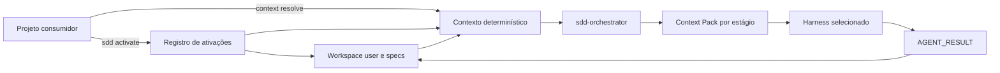
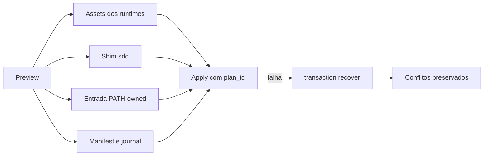

# Escopo user e resolução de contexto

O escopo `user` guarda a ativação fora do repositório do projeto. Isso permite
que o mesmo projeto seja usado pelo GitHub Copilot, Claude Code, Codex e Cursor sem
versionar caminhos absolutos, estado de sessão ou especificações pessoais.

## Ativar um projeto

Na raiz do projeto consumidor, faça primeiro um preview:

```bash
sdd activate --dry-run
```

Se o plano estiver correto, aplique:

```bash
sdd activate
```

A ativação grava o registro em:

- Windows: `%LOCALAPPDATA%/SDD-Toolkit/user/activations.json`;
- Linux: `$XDG_STATE_HOME/sdd-toolkit/user/activations.json` ou
  `~/.local/state/sdd-toolkit/user/activations.json`;
- macOS: `~/Library/Application Support/sdd-toolkit/user/activations.json`.

O workspace é criado em
`<perfil>/sdd-history-implementations/<projeto>-<project_id-curto>/<projeto>/specs`.
O projeto não recebe qualquer arquivo durante essa operação. Para testes e ambientes isolados, `SDD_TOOLKIT_HISTORY_DIR` permite
escolher uma raiz de histórico dedicada.



O vínculo é local ao usuário: ativar um projeto não cria, altera ou versiona
arquivos dentro dele.

## Resolver o contexto antes de executar um agente

```bash
python scripts/sdd.py context resolve --project-path /caminho/meu-projeto --json
python scripts/sdd.py context resolve --project-path /caminho/meu-projeto --ticket ABC-123 --json
```

O resultado informa `project_id`, escopo efetivo, runtime, perfil, workspace e,
quando solicitado, o caminho da especificação do ticket. O comando é somente
de leitura. Um projeto sem ativação retorna `status: unactivated` e uma sugestão
implícita para executar `activate`.

Após essa resolução, o usuário usa somente o orquestrador no fluxo normal. Ele
monta e persiste os Context Packs no workspace pessoal; o projeto consumidor não
recebe arquivos de estado, agentes ou configuração do toolkit.

## Limites atuais

Instalação e resolução por projeto não fazem parte do toolkit; ative o projeto
no escopo `user` para criar o registro e o workspace pessoal. O escopo `organization` continua
bloqueado até existir provider com autenticação, aprovação e rollback auditável.

O registro contém somente metadados de caminho, runtime, perfil e versão. Não
deve conter tokens, credenciais, prompts privados ou conteúdo de specs.

## Instalar os assets nos harnesses do usuário

Os wrappers são a interface recomendada porque também criam o comando `sdd` e
configuram o PATH do usuário:

Primeiro, faça apenas o preview:

```powershell
.\install.ps1 -Scope user -Runtime all -DryRun
```

```bash
bash install.sh --scope=user --runtime=all --dry-run
```

> **Importante:** os comandos acima não alteram a máquina. Após conferir o
> plano, execute a instalação real sem `-DryRun`/`--dry-run`:

```powershell
.\install.ps1 -Scope user -Runtime all
```

```bash
bash install.sh --scope=user --runtime=all
```

Para ambientes gerenciados, use `-NoPath`/`--no-path`. `-InstallRoot` ou
`--install-root` direcionam o shim para uma raiz dedicada. `-ProfileRoot` ou
`--profile-root` existem para homes redirecionados e testes isolados.

A CLI também pode ser chamada diretamente:

```bash
python scripts/sdd.py install --scope user --runtime all --json
python scripts/sdd.py install --scope user --runtime all --apply --json
```

Os destinos são `~/.copilot/agents` e `~/.copilot/skills` para Copilot,
`~/.claude/agents` e `~/.claude/skills` para Claude Code, `~/.codex/agents`
e `~/.agents/skills` para Codex, e `~/.cursor/agents` e `~/.agents/skills`
para Cursor. Codex e Cursor compartilham as skills em `.agents/skills`,
registradas uma única vez com os dois runtimes. O registro de
ownership fica no estado do toolkit. Arquivos preexistentes que não pertencem
ao toolkit viram conflito no preview e nunca são sobrescritos automaticamente.
Use `--profile-root` somente em ambientes isolados, testes ou quando o perfil
do harness estiver redirecionado.

O escopo `organization` permanece bloqueado neste estágio: a publicação precisa
de provider, autenticação e aprovação PR-first, que serão implementados nas
etapas ORG do roadmap.

## Diagnóstico, atualização e remoção

Todos os comandos abaixo são preview por padrão; `--apply` é a confirmação
explícita. Eles operam somente no escopo user e não alteram projetos,
workspaces ou specs.

```bash
python scripts/sdd.py doctor --scope user --json
python scripts/sdd.py update --scope user --runtime all --json
python scripts/sdd.py update --scope user --runtime all --apply --json
python scripts/sdd.py uninstall --scope user --json
python scripts/sdd.py uninstall --scope user --apply --json
```

Arquivos modificados, symlinks, shims sem ownership e blocos de PATH alterados
são preservados e aparecem como conflito. O `doctor` detecta os executáveis
`copilot`/`github-copilot`, `claude`, `codex` e `agent`/`cursor`, tenta ler os
argumentos de versão declarados pelo adapter com timeout e informa capabilities,
escopos, destinos e versão. Clientes ausentes ou versões desconhecidas não
falham a instalação.

As capabilities são resolvidas por uma tabela versionada em
`runtimes/capabilities.json`. Se a saída de versão for desconhecida, nenhum
recurso opcional é presumido compatível; o diagnóstico informa
`capability_status: unknown-version`. A validação manual com o harness real
continua obrigatória antes de promover uma release.

## Contrato de entrega das demandas

O tipo da demanda e a estratégia de verificação ficam no `task.md`, fora do
projeto consumidor quando o escopo é `user`. A CLI permite conferir o contrato
antes de entregar a demanda ao harness:

```bash
sdd delivery propose --type feature --description "Tela web de pedidos" --json
sdd delivery validate --task "$HOME/sdd-history-implementations/<projeto>-<id>/<projeto>/specs/ABC-123/task.md" --json
```

O contrato distingue o agente que produz a entrega da etapa que apenas a
verifica. Para `delivery_kind: e2e-tests`, `sdd-generate-e2e-tests --generate`
produz os arquivos da suíte; `--run` é uma operação posterior e independente
que gera a evidência `payload.e2e`.



### Transações e recuperação após interrupção

`install`, `update` e `uninstall` usam um plano identificado por SHA-256 e um
journal persistente por operação. Quando chamados pelos wrappers user, assets,
shim, PATH e manifest pertencem à mesma transação. Para garantir que o estado não mudou desde o
preview, aplique usando o `plan_id` retornado:

```bash
sdd install --scope user --runtime all --json
sdd install --scope user --runtime all --plan-id <PLAN_ID> --apply --json
```

Se o processo for encerrado durante assets, PATH ou manifest, os demais
comandos mutáveis ficam bloqueados até a recuperação:

```bash
sdd transaction status --scope user --active-only --json
sdd transaction recover --scope user --json
sdd transaction recover --scope user --apply --json
```

O preview de recovery não altera arquivos. A recuperação restaura somente
alvos presentes no plano e que ainda tenham o hash esperado. Arquivos alterados
depois da interrupção são preservados como conflito. O PATH completo do Windows
não é persistido: o journal registra somente a entrada owned e sua presença.

Para atualizar diretamente a partir de um repositório Git, use uma URL e ref
explícitos. O fluxo clona em staging, valida o kit e então instala os assets:

```bash
python scripts/sdd.py update --scope user \
  --repository-url https://github.com/fellipemauriciosilva/sdd-toolkit.git \
  --channel main --ref main --runtime all --apply --json
```

## Origem Git do toolkit

Para instalar uma cópia estável do toolkit sem depender do diretório do clone
atual, registre uma origem Git e uma tag/ref explícita:

```bash
python scripts/sdd.py source install \
  --repository-url https://github.com/fellipemauriciosilva/sdd-toolkit.git \
  --channel main --ref main --apply --json
python scripts/sdd.py source status --json
```

O comando usa staging e valida `VERSION`, CLI, state engine, dist, templates e
schemas antes de promover o checkout. Um checkout existente com alterações
locais é bloqueado. O `update --scope user --repository-url ... --apply` combina
essa atualização com a instalação dos assets; `install --scope user
--kit-root <source-root>` continua disponível para revisão manual.

Quando o repositório já estiver em cache local, `source install --offline`
reutiliza o checkout validado sem acessar a rede. Atualizações para uma versão
inferior são bloqueadas por padrão; use `--allow-downgrade` somente após revisar
o preview.
